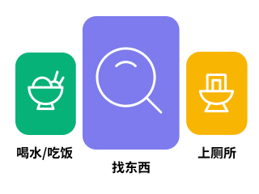
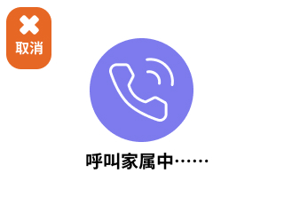

# STM32H7 Aphasia Helper
失语症患者辅助设备

## Hardware
- STM32H7A3ZI-Q
- OV7670 (Camera): 320x240, 30fps, RGB565
- ST7735 (2.8" TFT LCD): 240x320, RGB565
- ATK-MPU6050 (Gyroscope)
- LD3320 (Voice Recognition)
- Passive Buzzer

## PCB

## Encoding
- GB2312

## UI
- Home 

- Calling

## Project Configuration
- Target: Use MicroLIB
- Debug: ST-Link Debugger

## References
- [Hardware SPI Register](https://www.armbbs.cn/forum.php?mod=viewthread&tid=117991)
- [RGB565 to RGB888](https://stackoverflow.com/questions/2442576/how-does-one-convert-16-bit-rgb565-to-24-bit-rgb888)
- [X-Cube-AI MCUNet](https://github.com/mit-han-lab/mcunet)
