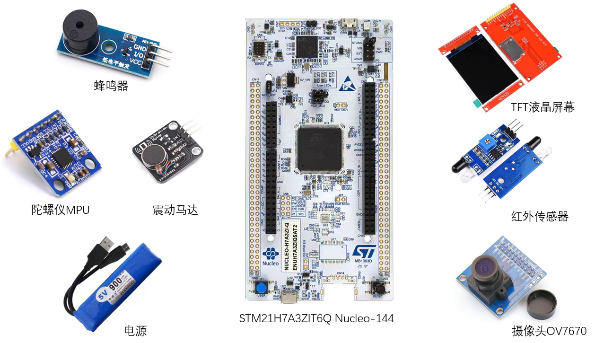

# STM32H7 Aphasia Helper
失语症患者辅助设备，全国大学生嵌入式芯片与系统设计竞赛，嵌入式人工智能赛道。

## Table of Contents
- [Product](#product)
- [X-Cube-AI](#x-cube-ai)
- [Hardware](#hardware)
  - [Connection](#connection)
- [PCB](#pcb)
- [3D Model](#3d-model)
- [Pins Configuration](#pins-configuration)
- [UI](#ui)
- [Project Configuration](#project-configuration)
- [Encoding](#encoding)
- [References](#references)

## Product

## X-Cube-AI

## Hardware

- STM32H7A3ZI-Q (MCU)
- OV7670 (Camera): 320x240, 30fps, RGB565
- ST7735 (2.8" TFT LCD): 240x320, RGB565
- ATK-MPU6050 (Gyroscope)
- LD3320 (Voice Recognition) (Not used)
- Passive Buzzer
- Infra-red Sensor
- Vibration Motor
- Lithium Battery (5V, Micro USB)

### Connection

## PCB

## 3D Model

## Pins Configuration

## UI
- Home 

- Calling

## Project Configuration
- Target: Use MicroLIB
- Debug: ST-Link Debugger

## Encoding
- GB2312

## References
- [Hardware SPI Register](https://www.armbbs.cn/forum.php?mod=viewthread&tid=117991)
- [RGB565 to RGB888](https://stackoverflow.com/questions/2442576/how-does-one-convert-16-bit-rgb565-to-24-bit-rgb888)
- [X-Cube-AI MCUNet](https://github.com/mit-han-lab/mcunet)
